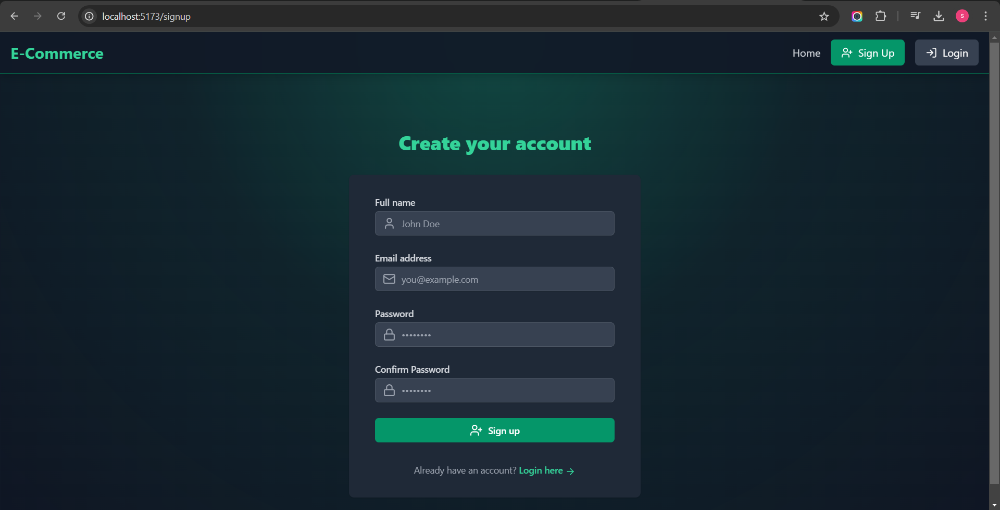
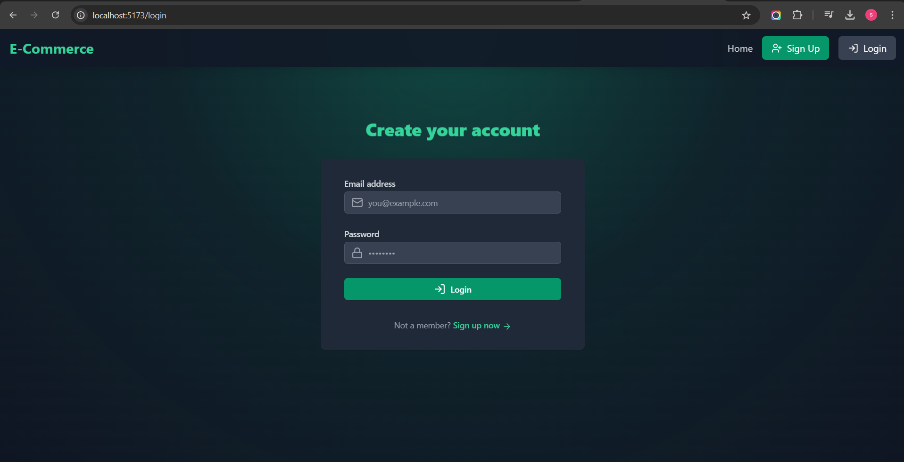
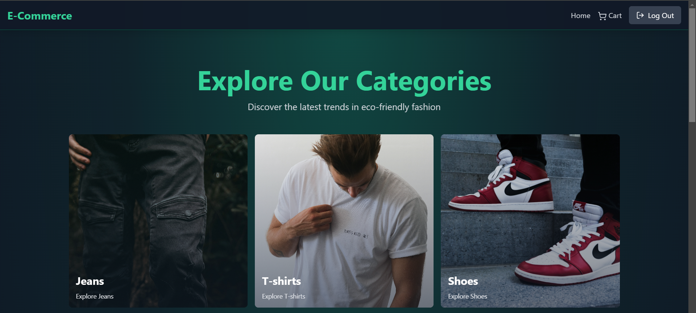
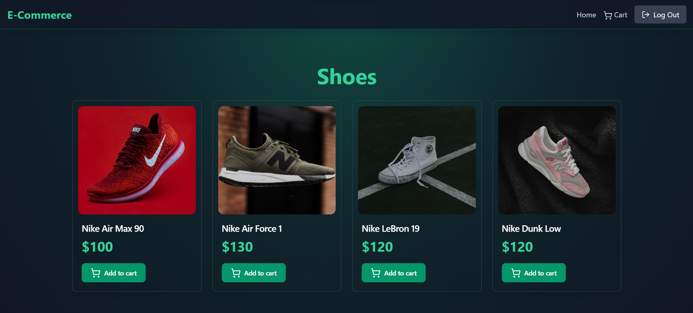
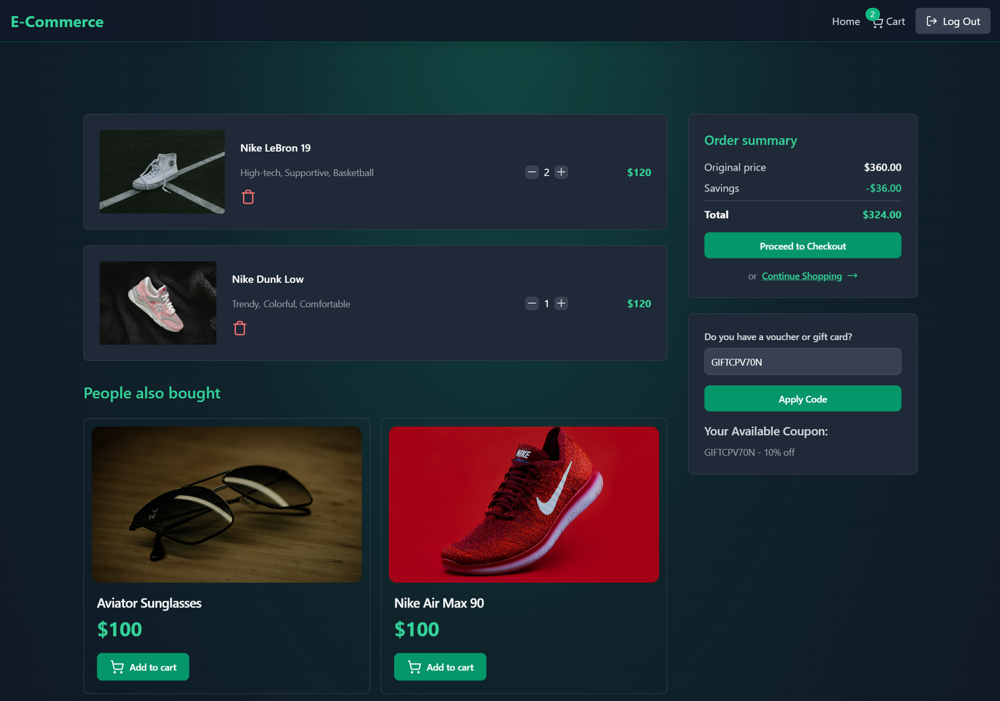
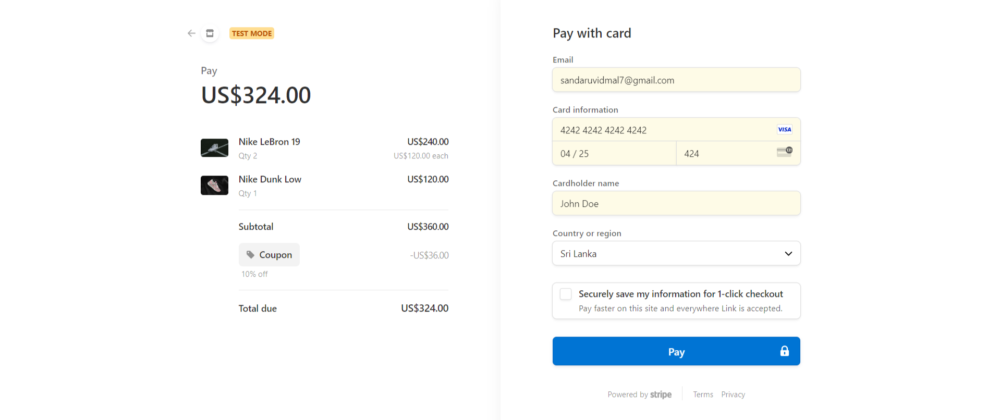
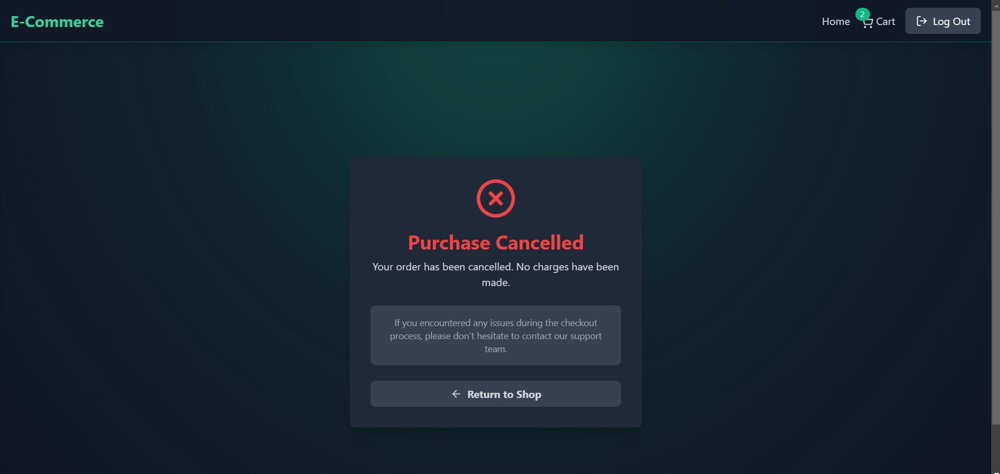
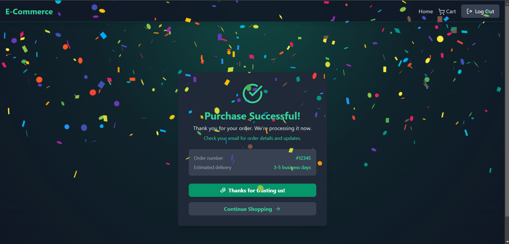
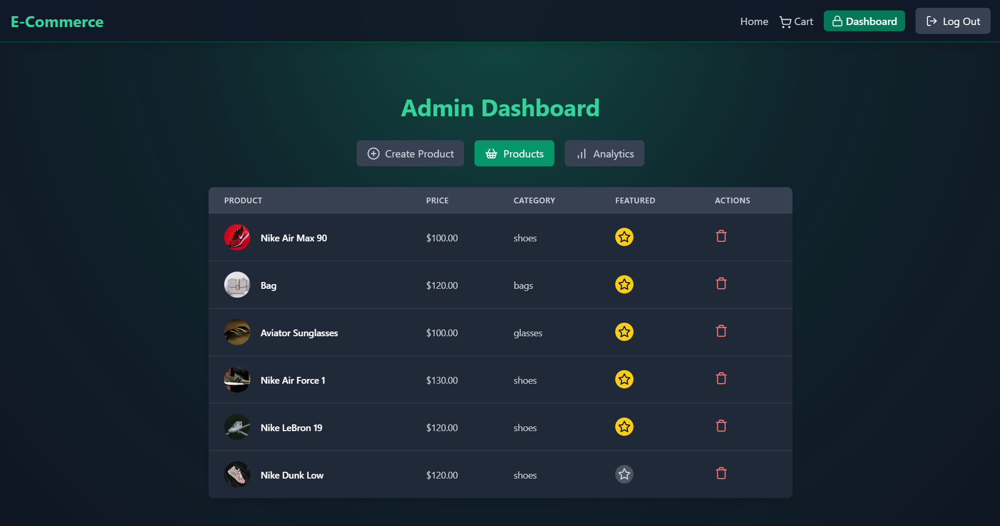
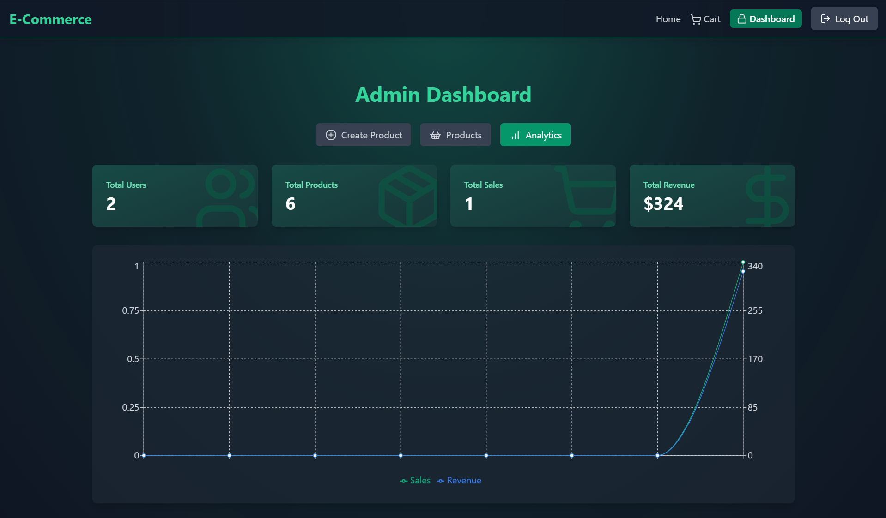

<p align="center">
  
  
</p>
<p align="center">
  
  
</p>


<p align="center">
  
</p>

<p align="center">
  
</p>

<p align="center">
  
  
</p>

<p align="center">
  
  
</p>

<p align="center">
  
</p>


# [E-Commerce Platform](#e-commerce-platform)

## 📋 [Table of Contents](#table-of-contents)
1. 🤖 [Introduction](#introduction)
2. ⚙️ [Tech Stack](#tech-stack)
3. 🔋 [Features](#features)
4. 🤸 [Quick Start](#quick-start)

## 🤖 [Introduction](#introduction)
The eCommerce Platform is a full-stack web application built to provide an end-to-end shopping experience. It includes features such as product browsing by category, a shopping cart with quantity management, and payment processing via Stripe. The system automatically applies a 10% discount for orders over $200, enhancing the customer experience. It also has an admin dashboard for managing products and monitoring sales analytics, including weekly revenue, user counts, and product counts, providing comprehensive insights for business owners.

## ⚙️ [Tech Stack](#tech-stack)
- **Frontend**: React.js (Vite)
- **Backend**: Node.js with Express
- **Database**: MongoDB
- **Styling**: Tailwind CSS
- **Payment Integration**: Stripe
- **Image Uploads**: Cloudinary
- **Caching**: Redis

## 🔋 [Features](#features)
👉 **User Authentication**: Secure login and sign-up using JWT (JSON Web Tokens).

👉 **Product Browsing**: Users can browse products by category and add items to their cart.

👉 **Cart Management**: Add, remove, or update product quantities in the cart.

👉 **Order Summary & Coupons**: Orders over $200 automatically apply a 10% discount.

👉 **Payment Gateway**: Secure payments using Stripe.

👉 **Admin Dashboard**: Manage products, view featured products, and access sales analytics.

👉 **Sales Analytics**: Weekly sales, revenue, user counts, and product statistics for admins.

👉 **Profile Management**: Users can update their profile and track their orders.

👉 **Cloudinary Integration**: Upload and manage product images.

👉 **Error Handling**: Graceful error handling for orders, authentication, and product management.

## 🤸 [Quick Start](#quick-start)

1. **Clone the repository**:
   ```bash
   git clone https://github.com/vidmal001/Fullstack-E-commerce-Platform-with-Admin-Dashboard.git
   ```

2. **Navigate to the frontend folder**:
   ```bash
   cd frontend
   ```

3. **Install the frontend dependencies**:
   ```bash
   npm install
   ```

4. **Go back to the root directory**:
   ```bash
   cd ..
   ```

5. **Install the backend dependencies**:
   ```bash
   npm install
   ```

6. **Set up environment variables**:

   **Root (.env)**:
   - Create a `.env` file in the root directory.
   - Add the following:
     ```env
     PORT = 5000
     MONGO_URI = your_mongo_uri
     UPSTASH_REDIS_URL = your_redis_url
     ACCESS_TOKEN_SECRET = your_access_token_secret
     REFRESH_TOKEN_SECRET = your_refresh_token_secret
     STRIPE_SECRET_KEY = your_stripe_secret_key
     CLOUDINARY_CLOUD_NAME = your_cloud_name
     CLOUDINARY_API_KEY = your_cloudinary_api_key
     CLOUDINARY_API_SECRET = your_cloudinary_api_secret
     CLIENT_URL = http://localhost:5173
     ```

   **frontend Side (.env)**:
   - Navigate to the `frontend` folder.
   - Create a `.env` file in the frontend directory.
   - Add the following:
     ```env
     VITE_STRIPE_PUBLISHABLE_KEY=your_stripe_publishable_key
     ```

7. **Run the client**:
   ```bash
   cd frontend && npm run dev
   ```

8. **Run the backend**:
   ```bash
   npm run dev
   ```

Now, the frontend will be available at `http://localhost:5173`.
